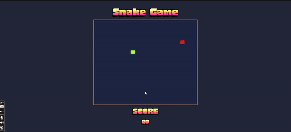

# Snake Game

Welcome to the Snake Game – a thrilling adventure where you control a snake to devour food and grow longer, now with an added challenge in the high-level mode featuring obstacles. Navigate through the challenge, but watch out for walls and your own tail!

## Table of Contents
- [Introduction](#introduction)
- [Features](#features)
- [Getting Started](#getting-started)
- [Game Controls](#game-controls)
- [Scoring](#scoring)
- [Sound Effects](#sound-effects)
- [Levels](#levels)
- [Game Over](#game-over)
- [Play Again](#play-again)

## Introduction

Embark on a classic gaming experience with our Snake Game, skillfully crafted using HTML, CSS, and JavaScript.

## Features

- Responsive Snake Game with a grid-based layout.
- Simple and intuitive controls using arrow keys.
- Scoring system to keep track of your game progress.
- Sound effects for eating food and game over events.
- Multiple difficulty levels: Low, Medium, and High.

## Getting Started

To play the Snake Game, follow these steps:

1. Clone the repository:
git clone https://github.com/noranzaki/Snake-Game

2. Open the index.html file in your web browser.

3. Adjust the game settings (display arrows and difficulty level) in the start menu.

4. Click the "START" button to begin the game.

## Game Controls
Control the snake with simple yet intuitive keyboard inputs:
- **Arrow Up**: Move Up
- **Arrow Down**: Move Down
- **Arrow Left**: Move Left
- **Arrow Right**: Move Right

## Scoring
Each time the snake eats food, your score increases.

The score is displayed in the middle of the game screen.

## Sound Effects
Immerse yourself in the gameplay with dynamic sound effects:
- 🎵 **Eat Sound**: A satisfying crunch when the snake devours food.
- 🎶 **Game Over Sound**: A somber note signaling the end of the game.

## Levels
Adjust the difficulty with different levels:
- **Low**: Slow and steady.
- **Medium**: A moderate pace.
- **High**: Fast and intense with strategically placed obstacles!

## Game Over
The game ends when the snake collides with the walls or itself.

A game over message is displayed, showing your score and highest score in the selected level (Low, Medium, High).

## Play Again
Click the "PLAY AGAIN" button to start a new game.